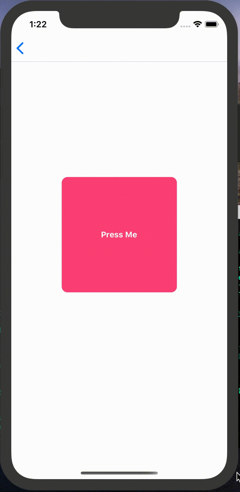

# react-native-pressablebutton
button look like pressable
# installation
npm install react-native-pressablebutton
# example



````
import React,{Component} from 'react';
import {View,Text} from 'react-native';
import Pressablebutton from 'react-native-pressablebutton';

class App extends Component {
    render () {
        return (
            <View style={{flex: 1,justifyContent: 'center',alignItems: 'center'}}>
                <Pressablebutton>
                    <View style={{justifyContent: 'center',alignItems: 'center',width: 100,height: 40,lineHeight: 40,backgroundColor: '#ee5b66',borderRadius: 5}}>
                        <Text style={{fontWeight: 'bold',color: '#fff'}}>Press Me</Text>
                    </View>
                </Pressablebutton>
            </View>
        )
    }
}

export default App;

`````
# usage
| property | type | required | description |
| :------: | :------: | :------: | :------: |
| onPress | func | no | onPress |
| minScale | number | no | minScale |
| duration | number | no | animation duration |
